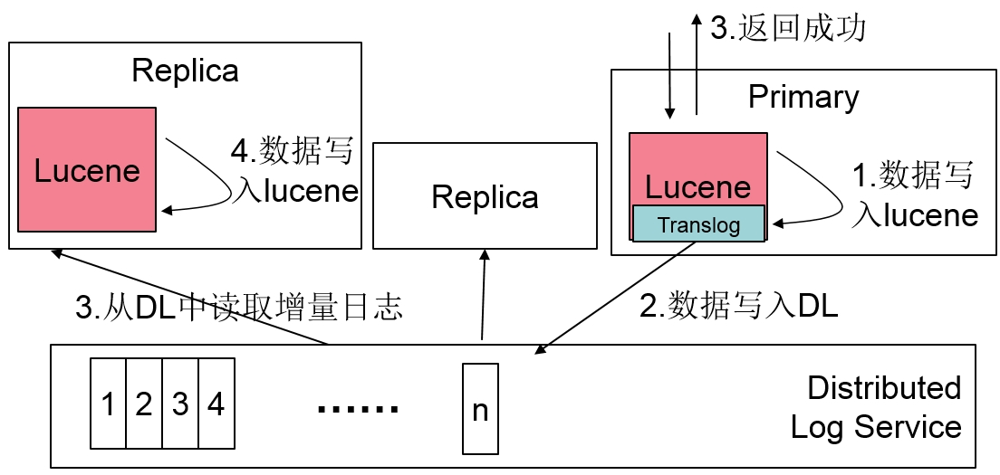

#百度改进的Elasticsearch
## 介绍
[Elasticsearch](https://github.com/elastic/elasticsearch)是一个灵活、功能强大的开源、分布式的实时搜索和分析引擎，百度从2014年开始在内部使用Elasticsearch来解决日志分析，多维分析，文本检索等问题。 在使用的过程中遇到了一系列的问题，比如Elasticsearch的多副本一致性，脑裂问题，查询语言不易用等。针对这些问题百度做了一系列的优化和改进，改进主要基于社区版本的Elasticsearch 2.3.3 和 Crate 0.55.

## 主要改进

### 支持SQL并兼容MySQL链接协议
Crate是社区基于Elasticsearch开发的一个SQL数据库，我们引入了Crate，使用户能够直接使用SQL来查询Elasticsearch中的数据。但是使用Crate时用户仍然需要依赖Crate独有的客户端lib库，为此我们增加了MySQL链接协议，用户可以通过任意的MySQL客户端或者MySQL的驱动程序来访问Elasticsearch，例如我们通过MySQL的命令行工具访问Elasticsearch的效果如下：

    mysql> create table test_table(username string, age int);

    mysql> insert into test_table values('xiao ming', 12);

    mysql> select * from test_table;

    +------+--------------+
    |  age |    username  |
    +------+--------------+
    |  12  |    xiao ming |
    +------+--------------+

在使用中我们发现SQL的表达虽然清晰易懂，但是还是不能完全覆盖Elasticsearch原有的基于JSON的查询能力，所以我们扩充了Crate的SQL语法，增加了对HTTP查询的支持，例如用户可以通过以下请求来发送一个简单的search查询：

    mysql> HTTP POST /_search {
        ->   "query": {
        ->       "match_all":{}
        ->   }
        ->}
查询结果以一个大的JSON字符串的形式返回。 通过扩充查询，用户完全可以在mysql命令行下或者mysql的驱动程序里完成所有的Elasticsearch查询或者写入操作。

### 权限管理
Elasticsearch的社区版本一直没有权限管理能力，而Elastic公司的shield一直都是收费的，所以我们自己开发了权限管理功能。 权限管理的要点如下：

- 整个权限管理的模型是database和table两级来进行管理。
- 对于Elasticsearch内存储的Index我们都强制用户命名成 xxx.xxxx的形式，前一部分表示database，后一部分表示table，也就是 database.table。 
- 管理员可以分别对database和table给用户授权，在这种模型下，当多个业务共同使用一个Elasticsearch集群时，各个业务分别使用不同的database的名字，可以通过database的授权来阻止未授权的业务方访问数据，同时不同的database名字也起到了namespace的作用，达到了各个业务方index命名的隔离；在一个database下，还可以将表的权限授权给不同的用户。 
- 权限的类名分为READ_ONLY 和 READ_WRITE 两种， READ_ONLY 表示对database或者table的只读权限， 当拥有database的READ_ONLY 权限时，也就拥有了对database下所有的table的只读权限了； READ_WRITE 表示对database或者table的读写权限， READ_WRITE 权限是包含READ_ONLY 权限的， 当对database有READ_WRITE 权限时，表示对database下的所有table都具备READ_WRITE能力。

权限管理的基本操作如下：

创建用户

    CREATE USER 'username' IDENTIFIED BY 'password';

删除用户

    DROP USER 'username';

修改密码
    
    ALTER USER 'username' IDENTIFIED BY 'new_password';

访问授权

    GRANT READ_WRITE ON dbname.tablename TO 'username';
    REVOKE READ_ONLY ON dbname.tablename FROM 'username';

查看用户列表
 
    SHOW USERS;

除了基本的用户、database、table的管理能力之外，我们还增加了白名单管理的能力，保证只有特定的物理机才能访问Elasticsearch服务。

    ALTER USER 'username' WHITELIST '192.168.1.*, mycomputer.baidu.com';

在系统中内置了两个特殊的用户 root 和 superuser 来对系统的不同层面进行管理：

- root： 集群的管理者，拥有所有的权限，比如 修改cluster setting， 节点加入退出管理， backup restore管理等。
- superuser： 管理数据的用户，这个用户能够创建删除用户，给用户授权，访问所有的数据，但是不具备修改集群参数配置的能力。

### 脑裂改进
Elasticsearch的社区版本的多个MasterNode之间的数据同步和选主方式一直没有明确的说明，从代码看不是RAFT也不是Paxos，所以很难判断是否正确，目前社区的很多工作都是通过测试各种Case来完善，所以我们决定改进它。通过一系列调研，我们最终选择Distributed Log来做Master Node之间，MasterNode和DataNode之间的元数据同步。

####选主方式
Distributed Log本身依赖了Zookeeper，所以我们的选主方式就直接依赖的Zookeeper，通过Zookeeper完成选主的工作。

####日志同步方式
当有数据变更时Master节点把变更Diff本身序列化，写入到Distributed Log中，其他的MasterNode和DataNode从Distributed Log中不断的读取增量向本地的State中Apply。
MasterNode会定期向所有的节点发送Ping消息用来检测节点的健康状况，节点给Master节点回复的时候会把本地的DLSN(Distributed Log中对每一个Log的编号)返回，Master节点根据返回的DLSN信息，取最小的值，然后把这个之前的Log全部Truncate。

### 多副本一致性
Elasticsearch多副本之间的一致性也是非常弱的，在引入Distributed Log来解决元数据脑裂的问题后，我们也使用Distributed Log来解决数据的一致性问题，主要的思路如下图所示：

这里需要特殊说明的是我们在Lucene内部集成了Translog的功能，在社区的Elasticsearch版本中Translog位于Lucene外部，由Elasticsearch来维护的，写入过程是先写入Lucene，然后再写入Translog，Translog的主要作用是保证数据的持久性，由于Lucene写入都是写入内存即返回成功，根据一定的条件把内存的数据flush到硬盘上，所以当Lucene由于某些原因crash的时候就需要依赖Translog来恢复内存里那些没有flush到硬盘的数据。

由于Lucene本身在写入数据时会对数据做analyzed，做一些判断，所以如果先写日志，再写Lucene就要解决日志写成功，但是Lucene写不成功的问题； 相反，如果先写Lucene再写日志，写完Lucene之后数据就会对应用可见，如果日志写不成功，机器宕机后，就会出现数据丢失。 为了解决这个问题，我们修改了Lucene的源码，给Lucene的每个操作增加了callback，比如当Lucene在写入一个文档后，立即调用Distributed Log的callback函数写log，如果log写成功，那么Lucene返回成功，如果log写入失败，那么Lucene需要crash掉，crash的过程会清空Lucene的内存状态，之前写入到Lucene的数据都会失效，整个shard进入恢复状态。

如果用户要使用基于Distributed Log的多副本一致性只需要在创建Index的时候指定 index.engine.use_distributed_log 为true即可，默认值是false，比如:

    PUT /index_name
	{
	    "settings": {
	        "number_of_replicas": 1,
	        "number_of_shards": 1,
	        "index.engine.use_distributed_log":true
	    }
	}

在使用了Distributed Log之后用户的数据的副本数跟日志的副本数是可以不一样的，即用户可以设置数据存2个副本，但是日志3个副本，一般情况下2个副本已经能够保证数据的可靠性了，在改进的Elasticsearch中，创建Index指定的number_of_replicas指定的是数据的副本数，日志的副本数需要在配置文件中指定，有两个参数 dl.replica_num 和 dl.quorum_num 分别表示存储多少个副本，写成功几个副本之后即返回。

读一致性

在基于Distributed Log的多副本管理的实现中，用户读取数据时，只能从primary副本上读取，不支持从replica副本上读取。 一个节点要能够满足读请求需要满足三个条件：

- 在元数据中被标记为primary，这个条件不满足，请求不会被转发到这个节点上。
- 本地的数据已经catch up到Distributed Log中的最新的数据，并且打开了log writer。这个条件保证了，本地Lucene中存储的数据是最新的。
- 从MasterNode上获取了Lease。

### 多租户管理
多个业务之间为了避免相互影响，常见的做法是搭建多套Elasticsearch的集群，维护多套Elasticsearch集群比较耗时废力，比如要配置Backup Restore， 配置线程池大小等，出现故障时还需要把业务和集群来对应上来找出现问题的集群。为了解决这个问题，我们在Elasticsearch内部集成了多租户管理的功能，大体的设计思路如下：
 

- 是每个节点启动多个Elasticsearch进程，每个Elasticsearch进程都放入到Cgroup中来限制CPU,Memory的使用。
- Elasticsearch内部可以对每个Index设置一些tag，Master节点在分配shard时，可以根据Index设置的tag以及物理机本身的一些tag来把shard分配到合适的物理节点上。多租户管理利用了这个特性，每个Index都有一个唯一的tag，即租户ID，每一个物理机也有一个唯一的tag，即所属的租户ID，租户ID这个tag用户不可以通过修改index setting的方式来修改，只能通过提供的SQL 接口来修改。

多租户管理提供的主要命令如下：

创建租户

    CREATE CLUSTER cluster_name with ("instance_num" = 2, "password"="superuser_password");
    CREATE CLUSTER cluster_name with ("instance_list" = "instance1:port1,instance2:port2");
    创建租户需要输入三个非常重要的参数： 租户的名字，租户实例的数目或者实例列表， 租户管理员密码。 每一个租户都有一个唯一的超级用户，
    这个超级用户可以在租户内做任何与数据相关的事情，比如创建用户，给用户授权等。

租户伸缩

    ALTER CLUSTER cluster_name SET instance_num = 1;
    ALTER CLUSTER cluster_name ADD NODES "ip:port";
    ALTER CLUSTER cluster_name DROP NODES "ip:port";
    租户伸缩时用户可以直接指定期望缩减或者扩张到的实例数目，可以通过 ADD和DROP的方式来显示的增减或删除实例。
    注： 所有的操作都是只修改了元数据，数据的迁移依赖于Elasticsearch本身的数据迁移机制，数据迁移本身可能不成功，需要root用户根据
    Elasticsearch的cluster state进行判断。比如用户有一个Index，设置的replica_num=1，计算primary shard时总共的副本数目是2，
    此时用户有2个实例，如果用户强制drop一个实例时操作会成功，但是后台数据迁移是无法成功的。这里并没有在从租户中移除实例时，
    直接把实例上存储的这个租户的数据删除的原因是： 如果直接删除了，那么用户数据的副本数目可能就在这个过程中变成1了，如果此时有宕机，
    那么集群可能就不可用了。极端的情况下，如果用户的数据本身就只有Primary这个副本，而恰好Primary这个副本又在这个实例上，那么会直接造成数据丢失。

数据迁移

    MIGRATE TABLE table_name TO dest_cluster_name;
    数据迁移是一个非常重要的功能，在实际使用中，由于无法提前预估业务的使用情况所以经常是刚开始各个业务共享一个租户，
    突然有一个业务的规模很大时就需要把这个很大的业务迁移到别的租户上，对于在线业务来说，往往要求业务不能中断，迁移过程中对业务透明。
    MIGRATE 命令就能够达到这个效果，MIGRATE命令实际上只改了Index的tag，Elasticsearch后台会根据tag把数据迁移到对应的租户的物理节点上。

删除租户

    DROP CLUSTER cluster_name;
    删除租户时如果租户上还有Index或者Table，那么会先把Index和Table删除，然后再把租户删除。
    
为了兼容过去已有的业务，当集群刚部署的时候是没有租户的概念的，用户创建的每个Index都在默认的default租户下，默认所有的实例也都属于默认的租户，当有新的租户创建时，会把实例从默认的租户中移除，分配到新的租户中。

用户登录

    > mysql -hhostname -P7306 -uusername@cluster_name -ppassword
    用户登录时，如果在username后面通过@指定了cluster_name，那么就表示这个用户是属于这个租户的，
    以后这个用户建立的所有的Index都默认属于这个租户。    

目前的多租户是没有命名空间管理的，所以所有的用户都可以看到别的用户有哪些Index或者Table，用户可以通过权限的方式来做到限制别的租户访问自己的数据。命名空间没有做彻底的主要原因是Elasticsearch对Index的管理都是根据Index的名字进行管理的，没有ID化，比如在Lucene里就直接存储了Index Name，所以不能简单的通过元数据的映射来解决多个租户之间的Index命名问题。

### Reindex支持

Elasticsearch是基于Lucene索引的架构，当一个字段没有索引时是不能用作过滤条件的(script 除外)，但是Elasticsearch本身又不支持对已经写入的数据做index，那么就需要用户在写入数据之前就想好有哪些字段需要建索引，在我们使用的过程中发现用户很难想清楚，一般都直接对所有的字段都建索引，这种方式在导入时对CPU消耗比较大，多余的Index也比较浪费存储空间，为此我们增加了reindex功能，主要语法如下：

先创建一个普通的Index，在Index中有一个mapping，名字叫做mapping1，只有一个字段field1，对这个字段不建索引。

    POST /test_reindex/_mapping/mapping1
    {
        "mapping1":{
            "properties":{
                "field1":{
                    "type": "string",
                    "index": "no"
                 }
             }
        }
    }

如果在使用过程中需要索引支持时，只需要运行下面这个命令即可，在url后面增加 reindex=true

    POST /test_reindex/_mapping/mapping1?reindex=true
    {
        "mapping1":{
            "properties":{
                "field1":{
                    "type": "string",
                    "index": "not_analyzed"
                 }
             }
        }
    }

后台实现的方式是给每一个mapping都增加了一个mapping version，如果用户修改了mapping，那么mapping version会加1，用户导入的每个json文件在底层存储时都会增加一个mapping version字段，用于标识这个记录是基于哪一个mapping来解析并存储的。在每个shard上会运行一个后台线程从Lucene中读取mapping version比当前最新的mapping version小的record，然后读取出来之后，用最新的mapping version解析，然后再写回Lucene中。

这个机制的优点是：

- reindex的过程都在每个shard的本地执行，没有网络通信，所以性能非常高。
- 一定程度上对用户透明，用户不需要对应用层做任何变动。

注：这种reindex机制对于没有建立索引的字段修改成建立索引是没有问题的，但是对于一个字段如果之前是not_analyzed，要修改成analyzed会有一定的问题，比如用户之前通过term查询能够查到结果，但是改成analyzed之后，term查询就查询不到结果了，而且在数据量非常大的情况下reindex的速度比较慢，用户需要忍受这个不一致的时间。

### 其他改进
#### 磁盘使用quota配置
在生产环境下经常遇到Elasticsearch服务跟其他服务共享物理机，在共享时一方面需要限制Elasticsearch的CPU,Memory的使用量，另外一方面就是要限制Elasticsearch对磁盘的使用量，而Elasticsearch自带的High water mark和low water mark又满足不了我们的需求，为此我们增加了quota的功能，用户只需要在配置文件中对每个目录增加一下 #quota 即可，比如下面这个例子就表示 Elasticsearch对 /home/disk1/es_data 这个目录下最多使用100mb，对/home/disk2/es_data这个目录最多使用200mb。 

    path.data: /home/disk1/es_data#100mb,/home/disk2/es_data#200mb

一旦设置了quota，Elasticsearch原有的high water mark和low water mark计算时就以quota的设置作为整个磁盘空间的大小，比如我们设置quota为100mb，high water mark 为90%，那么就意味着当Elasticsearch在这个目录下存储的数据量达到90mb以上时，Elasticsearch就需要把这个目录下的shard进行迁移了； 如果达到100%时，数据插入会直接报磁盘空间不足的错误。

#### Node Name改进
过去Elasticsearch是根据names.txt中的配置随机给每个节点指定一个名字的，但是实际上这个名字没有任何意义，我们在调用 /_cat/nodes 这个API时显示了NodeName，我们得不到任何信息，所以我们把NodeName改为用hostname:port来表示，这样用户就能够直接看到是哪个机器的信息了。

#### 数据存储目录改进
Elasticsearch的数据目录是放在配置的path.data 目录下，如果看这个目录下的文件你会发现，下面会有0，1，2...这样的目录存在，Elasticsearch内部的原理是，首先看0这个文件夹是否被使用，如果被使用了，那么就看1这个文件夹，如果1没有被使用或者根本不存在，那么就用1这个文件夹，以此类推。假如当前Elasticsearch用的是0这个文件夹，我们发现，有时在Elasticsearch出问题重启的时候，Elasticsearch在检测0这个文件夹是否被使用的时候会误判，会认为0这个文件夹在使用，所以就新建一个1这个文件夹，这样原来存储在0这个文件夹里的数据相当于就没有了，如果数据只有一个primary的话，就会有数据丢失的问题。 因此我们去除了Elasticsearch在path.data下新建0,1,2这些文件夹的逻辑，我们要求必须直接使用path.data这个目录，不需要建新的文件夹，这样保证数据不会“丢失”。